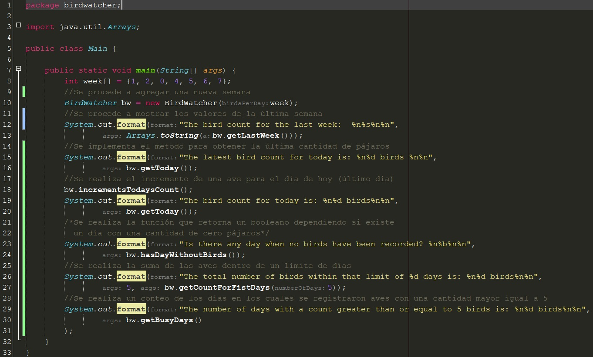
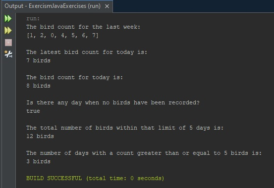

# Ejercicio BirdWatcher
## Vista del Main
Aquí hay una captura de pantalla de la clase principal de la carpeta BirdWatcher:

## Consola
A continuación, se muestra como se ve la consola al ejecutar el programa:

